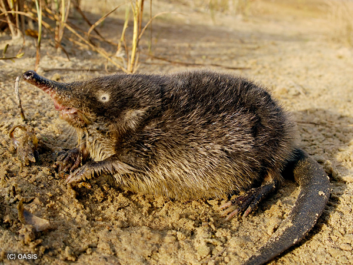

# DESMAN _De novo_ Extraction of Strains from MetAgeNomes



##Installation

To install simply type:
    
    sudo python ./setup.py install
    
These items are prerequisities for the installation of desman:

1. *python v2.7.*
2. *gcc
3. *gsl

The installation procedure varies on different systems, 
and described in this README is only how to proceed with a linux (ubuntu) distribution.

The first item, python v2.7.*, should be installed on a modern Ubuntu distribution. 
A c-compiler, e.g. gcc, is needed to compile the c parts of concoct that uses the 
GNU Scientific Library gsl. For linux (ubuntu) this is installed through:

```
    sudo apt-get install build-essential libgsl0-dev
```

For convenience we also recommend adding the scripts directory to your path:

```
export PATH=$HOME/myinstalldir/DESMAN/scripts:$PATH

````

Obviously replacing myinstalldir as appropriate and adding this to your .bash_profile file.

##Simple example

To illustrate the actual strain inference algorithm we will start with a simple example using base frequencies 
that have been pre-prepared. Below we also give [a complete example](#complete_example) including 
pre-processing. The starting point for a Desman analysis is a csv file with base frequencies e.g.: 

[Strain mock community frequencies for COG0015](data/contig_6or16_genesL_scgCOG0015.freq)

This has the following format:

    Contig,Position,SampleName1-A,SampleName1-C,SampleName1-G,SampleName1-T,...,SampleNameN-A,SampleNameN-C,SampleNameN-G,SampleNameN-T

where SampleName1,...,SampleNameN gives the names of the different samples in the analysis. Followed 
by one line for each position with format:

    gene name, position, freq. of A in sample 1, freq. of C in 1,freq. of G in 1,freq. of T in 1,..., freq. of A in sample N, freq. of C in N,freq. of G in N,freq. of T in N 


###Finding variant positions for the test data set

The first step is to identify variant positions. This is performed by the desman script Variant_Filter.py. 
Start assuming you are in the DESMAN repo directory by making a test folder.

    mkdir test
    cd test

Then run the example data file which corresponds to a single COG from the mock community data set 
described in the manuscript. This COG0015 has 933 variant positions. The input file is in the data 
folder. We run the variant filtering as follows:

    python ../desman/Variant_Filter.py ../data/contig_6or16_genesL_scgCOG0015.freq -o COG0015_out -p

The variant filtering has a number of optional parameters to see them run:

    python ../desman/Variant_Filter.py -h
    
They should all be fairly self explanatory. We recommend always using the 
the '-p' flag for one dimenisonal optimisition of individual base frequencies if it is not 
too time consuming. The '-o' option is a file stub all output files will be generated with this prefix.
A log file will be generated 'COG0015_out_log.txt' and output files: 

1. COG0015_outp_df.csv: This gives p-values for each position.

2. COG0015_outq_df.csv: This gives q-values for each position.

3. COG0015_outr_df.csv: This gives log-ratio statistics for each position.

4. COG0015_outsel_var.csv: This is the file of selected variants.

5. COG0015_outtran_df.csv: A matrix of estimated error rates.

###Inferring haplotypes and abundances for the test data set

Having found the variant positions we will now the run the program for inferring haplotypes and their abundance:

    desman COG0015_outsel_var.csv -g 5 -e COG0015_outtran_df.csv -o COG0015_out_g5 -i 50 

These parameters specify the variants file. Then number of haplotypes as five '-g 5', an initial 
estimate for the error transition matrix taken from the variant detection '-e COG0015_outtran_df.csv', 
an output directory '-o COG0015_out_g5' and the number of iterations, '-i 50'.
The program takes the selected variants and infers haplotypes and their abundances using the Gibbs sampler given 
the assumption that five strains are present. All output files will be generated in the directory COG0015_out_g5. 
Once the program has finished running a few minutes on a typical computer it will generate the following 
files inside the output directory:

1. log_file.txt: This logs the progress of the program through the three stages: 
NTF initialisation, 'burn-in' Gibbs sampler and the sampling itself. 

2. Eta_star.csv: Prediction for error transition matrix (rows true bases, columns observed probabilities) 						

3. Filtered_Tau_star.csv: Prediction for strain haplotypes. Each row of comma separated file contains:

```
    gene name, position, haplotype1-A,  haplotype1-C,  haplotype1-G,  haplotype1-T,..., haplotypeG-A,  haplotypeG-C,  haplotypeG-G,  haplotypeG-T  
```

where 1 indicates the base present in that haplotype at that position.

4. Gamma_star.csv: This gives the relative frequency of each haplotye in each sample. One row for each sample.

5. Probabilistic_Tau.csv: Prediction for strain haplotypes but now an estimate of the poseterior probability of asignments.

6. Selected_variants.csv: Variants used for strain calling if filtering applied.

7. fit.txt: Statistics evaluating fit as number of haplotypes, number of non-degenerate haplotypes inferred, log-Likelihood, Aikake information criterion

#Complete example of _de novo_ strain level analysis from metagenome data#
<a name="complete_example"></a>

##Getting started##

To provide an in depth illustration of how to use Deman we will give a complete worked example from a subset of the synthetic community 
used in Quince et al. 2016. We have provided 16 samples, subsampled to 1 million reads from the 64 samples with 11.75 million reads used 
originally. This example is therefore more tractable but the following analysis assumes you have access to a multi-core server. 
We also assume that you have some standard and not so standard sequence analysis software installed:

1. [megahit](https://github.com/voutcn/megahit): A highly efficient metagenomics assembler currently our default for most studies

2. [bwa](https://github.com/lh3/bwa): Necessary for mapping reads onto contigs

3. [bam-readcount](https://github.com/genome/bam-readcount): Used to get per sample base frequencies at each position

4. [samtools] (http://www.htslib.org/download/): Utilities for processing mapped files

5. [CONCOCT](https://github.com/BinPro/CONCOCT): Our own contig binning algorithm

6. [prodigal] (https://github.com/hyattpd/prodigal/releases/): Used for calling genes on contigs

7. [gnu parallel] (http://www.gnu.org/software/parallel/): Used for parallelising rps-blast

8. [standalone blast] (http://www.ncbi.nlm.nih.gov/books/NBK52640/): Need rps-blast

9. COG RPS database: ftp://ftp.ncbi.nih.gov/pub/mmdb/cdd/little_endian/ Cog databases

10. [GFF python parser] (https://github.com/chapmanb/bcbb/tree/master/gff)

Click the link associated with each application for installation details. To begin obtain the reads from Dropbox:

```bash
wget https://www.dropbox.com/s/l6g3culvibym8g7/Example.tar.gz?dl=0
```

Rename, untar and unzip the example directory and move into it:

```bash
mv Example.tar.gz?dl=0 Example.tar.gz
tar -xvzf Example.tar.gz
cd Example
```

##Read assembly, mapping and binning##

Then assemble the reads. We recommend megahit for this:
```bash
nohup megahit -1 $(<R1.csv) -2 $(<R2.csv) -t 36 -o Assembly --presets meta > megahit.out&
```
This will take a while so we have set megahit running on 36 threads (adjust to your system) and 
run in background with nohup.

We will now perform CONCOCT binning of these contigs. As explained in [Alneberg et al.](http://www.nature.com/nmeth/journal/v11/n11/full/nmeth.3103.html) 
there are good reasons to cut up contigs prior to binning. We will use a script from CONCOCT to do this. For convenience we 
will create environmental variables points to the CONCOCT and DESMAN install directories:

```bash
export CONCOCT=$HOME/mypathtoConcoct/CONCOCT
export DESMAN=$HOME/mypathtoDesman/DESMAN
export DESMAN_EXAMPLE=$HOME/mypathtoDesmanExample/Example
```

Then cut up contigs and place in new dir:

```bash
mkdir contigs
python $CONCOCT/scripts/cut_up_fasta.py -c 10000 -o 0 -m Assembly/final.contigs.fa > contigs/final_contigs_c10K.fa
```

Having cut-up the contigs the next step is to map all the reads from each sample back onto them. First index the contigs with bwa:

```bash
cd contigs
bwa index final_contigs_c10K.fa
cd ..
```

Then perform the actual mapping you may want to put this in a shell script:

```bash
mkdir Map

for file in *R1.fastq
do 
   
   stub=${file%_R1.fastq}

   echo $stub

   file2=${stub}_R2.fastq

   bwa mem -t 32 contigs/final_contigs_c10K.fa $file $file2 > Map/${stub}.sam
done
```

Here we are using 32 threads for bwa mem '-t 32' you can adjust this to whatever is suitable for your machine.
Then we need to calculate our contig lengths using one of the Desman scripts.

```bash
python $DESMAN/scripts/Lengths.py -i contigs/final_contigs_c10K.fa > contigs/final_contigs_c10K.len
```

Then we calculate coverages for each contig in each sample:

```bash
for file in Map/*.sam
do
    stub=${file%.sam}
    stub2=${stub#Map\/}
    echo $stub	
    (samtools view -h -b -S $file > ${stub}.bam; samtools view -b -F 4 ${stub}.bam > ${stub}.mapped.bam; samtools sort -m 1000000000 ${stub}.mapped.bam -o ${stub}.mapped.sorted.bam; bedtools genomecov -ibam ${stub}.mapped.sorted.bam -g contigs/final_contigs_c10K.len > ${stub}_cov.txt)&
done
```

and use awk to aggregate the output of bedtools:

```bash
for i in Map/*_cov.txt 
do 
   echo $i
   stub=${i%_cov.txt}
   stub=${stub#Map\/}
   echo $stub
   awk -F"\t" '{l[$1]=l[$1]+($2 *$3);r[$1]=$4} END {for (i in l){print i","(l[i]/r[i])}}' $i > Map/${stub}_cov.csv
done
```

and finally run the following perl script to collate the coverages across samples, where we have simply adjusted the format 
from csv to tsv to be compatible with CONCOCT:

```bash
$DESMAN/scripts/Collate.pl Map | tr "," "\t" > Coverage.tsv
```

and run CONCOCT:
```bash
mkdir Concoct
cd Concoct
mv ../Coverage.tsv .
concoct --coverage_file Coverage.tsv --composition_file ../contigs/final_contigs_c10K.fa
cd ..
```

In this case we know which contig derives from which of the 20 genomes and so we can compare the assignment of 
contigs to clusters with those genome assignments. To get the genome assignments we first need the 
strain genomes:

```
wget https://www.dropbox.com/s/9ozp0vvk9kg2jf0/Mock1_20genomes.fasta?dl=0
mv Mock1_20genomes.fasta?dl=0 Mock1_20genomes.fasta
```

```
mkdir AssignGenome
cd AssignGenome
python $DESMAN/scripts/LengthFilter.py -m 1000 ../contigs/final_contigs_c10K.fa > final_contigs_gt1000_c10K.fa

``` 


From this it is apparent that four clusters: D5,D10,D11,D22 and D23 represent the *E. coli* pangenome. In general, 
it will not be known *a priori* from which taxa a cluster derives and so not possible to link them in this way.
However, in many analyses the pangenome will be contained in a single cluster or a contig taxonomic classifier 
could be used to determine clusters deriving from the same species. We illustrate how to do this below.

##Taxonomic classification of contigs

There are many ways to taxonomically classify assembled sequence. We suggest a gene based approach. The first step is 
to call genes on all contigs that are greater than 1,000 bp. Shorter sequences are unlikely to contain complete 
coding sequences. The following requires that you have a Diamond formatted version of the NCBI NR on your system. 
With environment variable NR_DMD set as appropriate:
```
export NR_DMD=$HOME/native/Databases/nr/FASTA/nr.dmnd
```

```
mkdir AssignTaxa
cd AssignTaxa
nohup diamond blastp -p 32 -d  -q final_contigs_gt1000_c10K.faa -a final_contigs_gt1000_c10K > d.out
diamond view -a final_contigs_gt1000_c10K.daa -o final_contigs_gt1000_c10K_nr.m8
```

To classify the contigs we need two files a gid to taxid mapping file and a mapping of taxaid to full lineage:

1. gi_taxid_prot.dmp

2. all_taxa_lineage_notnone.tsv

These can also be downloaded from the Dropbox:
``` 
wget https://www.dropbox.com/s/x4s50f813ok4tqt/gi_taxid_prot.dmp.gz?dl=0
wget https://www.dropbox.com/s/honc1j5g7wli3zv/all_taxa_lineage_notnone.tsv.gz?dl=0
```

The path to these files are hard coded in the ClassifyContigNR.py script as the variables:
```
DEF_DMP_FILE = "/home/chris/native/Databases/nr/FASTA/gi_taxid_prot.dmp"

DEF_LINE_FILE = "/home/chris/native/Databases/nr/FASTA/all_taxa_lineage_notnone.tsv"
```

Those need to be changed to the location of the files on your system.

Then we can assign the contigs and genes called on them:
```
python $DESMAN/scripts/ClassifyContigNR.py final_contigs_gt1000_c10K_nr.m8 final_contigs_gt1000_c10K.len -o final_contigs_gt1000_c10K_nr
```

Then we extract species out:
```
$DESMAN/scripts/Filter.pl 8 < final_contigs_gt1000_c10K_nr_contigs.csv | grep -v "_6" | grep -v "None" > final_contigs_gt1000_c10K_nr_species.csv
```

These can then be used for the cluster confusion plot:
```
$CONCOCT/scripts/Validate.pl --cfile=../Concoct/clustering_gt1000.csv --sfile=final_contigs_gt1000_c10K_nr_species.csv --ffile=../contigs/final_contigs_c10K.fa
```

and to plot the out Conf.csv which contains species proportions in each cluster:
```
$CONCOCT/scripts/ConfPlot.R -c Conf.csv -o Conf.pdf 
```


This confirms from a *de novo* approach that D5,D10,D11,D22 and D23 represent the *E. coli* pangenome.

##Identifying *E. coli* core genes

We now determine core genes single copy genes within these four clusters through annotation to COGs. First lets split the contigs 
by their cluster and concatenate togethers those from D5, D10, D11, D22 and D23 into one file ClusterEC.fa. Go back to 
the top level example directory and then:

```bash
mkdir Split
cd Split
$DESMAN/scripts/SplitClusters.pl ../contigs/final_contigs_c10K.fa ../Concoct/clustering_gt1000.csv
cat Cluster5/Cluster5.fa Cluster10/Cluster10.fa Cluster11/Cluster11.fa Cluster22/Cluster22.fa > ClusterEC.fa
cd ..
```

Now call genes on the *E. coli* contigs.

```bash
mkdir Annotate
cd Annotate
cp ../Split/ClusterEC.fa .
prodigal -i ClusterEC.fa -a ClusterEC.faa -d ClusterEC.fna  -f gff -p meta -o ClusterEC.gff
```

Next we assign COGs using the CONCOCT script RPSBLAST.sh. First set location of *your* COG rpsblast database. 
Then run the CONCOCT script. This requires rpsblast and gnu parallel.

```bash
export COGSDB_DIR=~/gpfs/Databases/rpsblast_db
$CONCOCT/scripts/RPSBLAST.sh -f ClusterEC.faa -p -c 8 -r 1
```

and extract out the annotated Cogs associated with called genes:
```bash
$DESMAN/scripts/ExtractCogs.py -g ClusterEC.gff -b ClusterEC.out --cdd_cog_file $CONCOCT/scgs/cdd_to_cog.tsv > ClusterEC.cogs
```

Then we determine those regions of the contigs with core COGs on in single copy using the 982 predetermined *E. coli* core COGs:
```bash
$DESMAN/scripts/SelectContigsPos.pl $DESMAN/complete_example/EColi_core_ident95.txt < ClusterEC.cogs > ClusterEC_core.cogs
```
Now we just reformat the location of core cogs on contigs:

```bash
cut -d"," -f2,3,4 ClusterEC_core.cogs | tr "," "\t" > ClusterEC_core_cogs.tsv
```

##Determine variants on core COGs

To input into bam-readcount:

```bash
cd ..
mkdir Counts

```

Before doing so though we need to index the contigs fasta file
```bash
samtools faidx contigs/final_contigs_c10K.fa
```

then run bam-readcount:
```bash
for file in Map/*sorted.bam
do
	stub=${file%.mapped.sorted.bam}
	stub=${stub#Map\/}
	echo $stub
	(bam-readcount -q 20 -l Annotate/ClusterEC_core_cogs.tsv -f contigs/final_contigs_c10K.fa $file 2> Counts/${stub}.err > Counts/${stub}.cnt)&
done
```

Next we collate the positions frequencies into a single file for Desman, here we use all genes regardless of length:

```bash
$DESMAN/scripts/ExtractCountFreqP.pl Annotate/ClusterEC_core.cogs Counts 0 > Cluster_esc3_scgs.freq
```

##Infer strains with Desman

Now lets use Desman to find the variant positions on these core cogs:
```bash
mkdir Variants
cd Variants/
mv ../Cluster_esc3_scgs.freq .
python $DESMAN/desman/Variant_Filter.py Cluster_esc3_scgs.freq
cd ..
```

and run Desman:
```bash
mkdir RunDesman
cd RunDesman

for g in 2 3 4 5 6 7 8; do     
    for r in 0 1 2 3 4; do             
        desman ../Variants/outputsel_var.csv -e ../Variants/outputtran_df.csv -o ClusterEC_${g}_${r} -r 1000 -i 100 -g $g -s $r > ClusterEC_${g}_${r}.out&                 
    done; 
done
cd ..
```

First lets have a look at the log-likelihood as a function of strain number:
```bash
cat */fit.txt | cut -d"," -f2- > LLike.csv
sed -i '1iH,G,LL,AIC' LLike.csv 
```

which we can plot with a simple R script included in the Desman distribution:
```bash
cd $DESMAN_EXAMPLE
$DESMAN/scripts/PlotLL.R -l RunDesman/LLike.csv -o RunDesman/LLike.pdf
```


From this it is clear that five strains are present. 

```
python ../DESMAN/scripts/taucomp.py RunDesman/ClusterEC_5_0/Gamma_star.csv RunDesman/ClusterEC_5_*/Collated_Tau_star.csv 
```

##Validation of strains

```
cd $DESMAN_EXAMPLE
mkdir Validate
cd Validate
wget ...
tar -xvzf Hits.tar.gz
```

Select core COGs that were included in our analysis...

```
mkdir Select
$DESMAN/Select.sh
$DESMAN/ReverseStrand.pl ../Annotate/ClusterEC_core.cogs
```


##Determine accessory genomes

Now we need variants frequencies on all contigs:

```bash
cd $DESMAN_EXAMPLE
$DESMAN/scripts/Lengths.py -i Annotate/ClusterEC.fa > Annotate/ClusterEC.len

mkdir CountsAll

$DESMAN/scripts/AddLengths.pl < Annotate/ClusterEC.len > Annotate/ClusterEC.tsv

for file in Map/*sorted.bam
do
	stub=${file%.mapped.sorted.bam}
	stub=${stub#Map\/}
	echo $stub
	(bam-readcount -w 1 -q 20 -l Annotate/ClusterEC.tsv -f contigs/final_contigs_c10K.fa $file > CountsAll/${stub}.cnt 2> CountsAll/${stub}.err)&
done
```

Then we collate the count files together filtering to genes greater than 500bp:
```
$DESMAN/scripts/ExtractCountFreqP.pl Annotate/ClusterEC.genes CountsAll 500 > Cluster_esc3.freq
```

and find variants this time insisting on a minimum frequency of 3% and not filtering on sample coverage:
```
mkdir VariantsAll
cd VariantsAll
mv ../Cluster_esc3.freq .
python $DESMAN/desman/Variant_Filter.py Cluster_esc3.freq -m 0.0 -v 0.03
cd ..
```

To assign contigs we also need individual gene coverages, for consistency we generate these from the 
aggregated count files:

```
python $DESMAN/scripts/CalcGeneCov.py Cluster_esc3.freq > Cluster_esc3_gene_cov.csv
```

```
cut -d"," -f5 ../Annotate/ClusterEC_core.cogs > ClusterEC_core_genes.txt
```

```
python $DESMAN/scripts/CalcDelta.py Cluster_esc3_gene_cov.csv ClusterEC_core_genes.txt ClusterEC_core
```

```
export SEL_RUN=$DESMAN_EXAMPLE/RunDesman/ClusterEC_5_1/
```


```
python $DESMAN/desman/ContigAssign.py ClusterEC_coremean_sd_df.csv $SEL_RUN/Gamma_star.csv Cluster_esc3_gene_cov.csv $SEL_RUN/Eta_star.csv -m 20 -v outputsel_var.csv -o ClusterEC --assign_tau > ClusterEC.cout&
```
